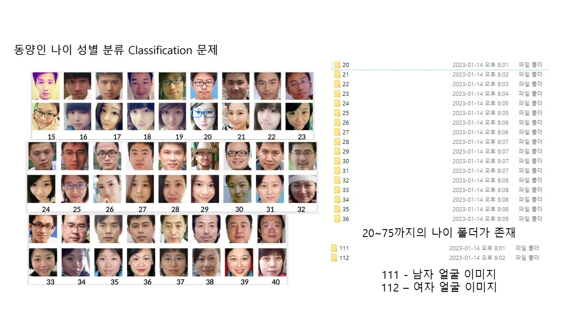

# 동양인 나이 성별 분류 프로젝트

MS AI School 프로젝트에서 제공 받은 동양인 이미지를 파이토치를 사용하여 분류하는 문제를 해결한다.

## 학습 목표
여러 연령과 성별의 얼굴 이미지들을 2030, 4050 그리고 60대 이상으로 3가지 세대로 분류한 후 성별 또한 분류하여 총 6가지로 분류하는 학습 모델을 생성한다.

## 코드 진행 순서

<ol>
    <li>preprocessing을 통하여 나이대 분류를 진행한다.</li>
    <li>Data_Split을 통하여 train, val 그리고 test 3가지로 이미지를 분류한다.</li>
    <li>main의 train val()을  동작하여 model 생성 및 acc 기록 파일 생성</li>
    <li>main의 model_eval()을 동작하여 model을 평가한다.</li>
</ol>

## 이미지 폴더 구조

